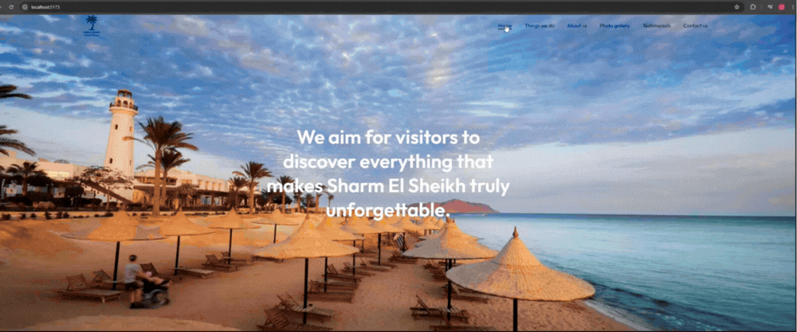

# Full-stack-web-application

## 📄 Project Description

This is a full-stack web application showcasing tourism. The project includes a React frontend and a Node.js/Express backend connected to a MySQL database.
The frontend is a single-page layout with smooth scrolling navigation that is built with React and Vite. Users can submit messages via the Contact Us form.

The Node.js/Express backend receives contact submissions from the Contact us section of the frontend, validates input, prevents duplicate entries(email/phone number), and stores data in a MySQL database.

The backend also exposes health checks. The health checks have been split into 2 categories, the liveness check (/live) which is used by orchestrators to know if the app is dead or alive and the readiness check (/ready) which validates that the app can serve traffic and that the database connection is available.

---



---

## Tech Stack

Frontend: React, Vite, CSS

Backend: Node.js, Express

Database: MySQL

---

## 📁 Full-stack-web-application project structure

```


Full-stack-web-application/
├── backend/
│   ├── package-lock.json
│   ├── package.json
│   └── server.js
├── frontend/
│   ├── src/
│   │   ├── assets/
│   │   │   ├── about-pic-4.png
│   │   │   ├── back-icon.png
│   │   │   ├── camel-trekking.png
│   │   │   ├── dark-arrow.png
│   │   │   ├── gallery-pic-1.png
│   │   │   ├── gallery-pic-2.png
│   │   │   ├── gallery-pic-3.png
│   │   │   ├── gallery-pic-4.png
│   │   │   ├── hero1.png
│   │   │   ├── location-icon.png
│   │   │   ├── logo.png
│   │   │   ├── mail-icon.png
│   │   │   ├── menu-icon.png
│   │   │   ├── msg-icon.png
│   │   │   ├── next-icon.png
│   │   │   ├── phone-icon.png
│   │   │   ├── play-icon.png
│   │   │   ├── quad-biking.png
│   │   │   ├── scuba-diving.png
│   │   │   ├── sharm-el-sheikh.mp4
│   │   │   └── white-arrow.png
│   │   ├── components/
│   │   │   ├── About/
│   │   │   │   ├── about.css
│   │   │   │   └── about.jsx
│   │   │   ├── Contact/
│   │   │   │   ├── contact.css
│   │   │   │   └── contact.jsx
│   │   │   ├── Footer/
│   │   │   │   ├── footer.css
│   │   │   │   └── footer.jsx
│   │   │   ├── Hero/
│   │   │   │   ├── hero.css
│   │   │   │   └── hero.jsx
│   │   │   ├── Navbar/
│   │   │   │   ├── navbar.css
│   │   │   │   └── navbar.jsx
│   │   │   ├── Photos/
│   │   │   │   ├── photos.css
│   │   │   │   └── photos.jsx
│   │   │   ├── Programs/
│   │   │   │   ├── programs.css
│   │   │   │   └── programs.jsx
│   │   │   ├── Testimonials/
│   │   │   │   ├── testimonials.css
│   │   │   │   └── testimonials.jsx
│   │   │   ├── Title/
│   │   │   │   ├── title.css
│   │   │   │   └── title.jsx
│   │   │   └── VideoPlayer/
│   │   │       ├── videoplayer.css
│   │   │       └── videoplayer.jsx
│   │   ├── app.jsx
│   │   ├── index.css
│   │   └── main.jsx
│   │
│   ├── eslint.config.js
│   ├── index.html
│   ├── package-lock.json
│   ├── package.json
│   └── vite.config.js
└── .gitignore

```

---

This project does not use Docker Compose for the database.
The backend connects directly to a locally running MySQL server ( via MySQL Workbench).

---

---

## Running the project locally:

<br>

1. Clone the repository

```
git clone https://github.com/SOMHOLUK/full-stack-web-application.git

```

2. Then

```
cd full-stack-web-application
```

3. Start the frontend:

```
cd frontend
```

4. And then

```
npm install

```

5. And then

```
npm run dev

```

5. You will be able to access the frontend at:

```
http://localhost:5173
```

6. Create a .env file inside the backend folder:

```
backend/ .env
```

Add the following:

```
PORT=3000
DB_HOST=localhost
DB_USER=your_mysql_user
DB_PASSWORD=your_mysql_password
DB_NAME=your_database_name
```

The .env file is needed for the backend to connect to the MySQL database.

7. Start the backend in a new terminal:

```
cd backend
```

8. Then:

```
npm install
```

9. Then:

```
node server.js
```

The backend will run on the port 3000, which would be identified in your .env file .

10. Health checks

You can confirm that the process is running by visiting:

```
http://localhost:3000/live
```

and you can confirm that the database connection is available by visiting:

```
http://localhost:3000/ready
```

The expected response for both will be: ok
# Full_Stack_Web
